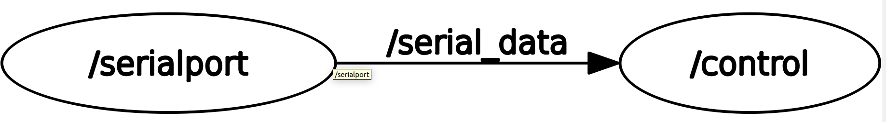
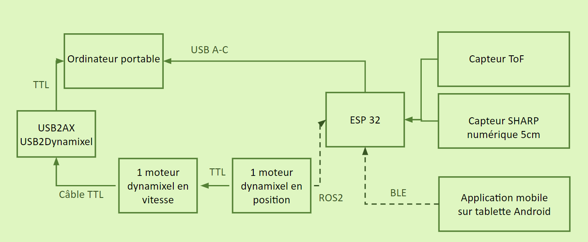

# pawject_elissalt
projet proto

Nous sommes Marie Arnaud, Adrien Covarel & Emma Elissalt 

## Problématique
  
Comment optimiser les besoins d'exercice, de stimulation mentale et d'interaction autonome, afin d’éviter l’ennui de votre chien, tout en offrant une solution pratique pour vous, propriétaires ?  

## Notre projet
  
Nous avons mis en place un robot (fixe) capable de lancer la balle de votre chien. Il marche avec une application mobile connectée en Bluetooth au robot qui sert à lancer la balle lorsque l’utilisateur appuie sur le bouton.  

  
## Mise en route

Dans un premier temps il fautr se connecter a notre application sur MIT App Inventor, PawJet (*PawJet.aia*). Pour cela, il suffit d'appuyer sur le bouton *connexion ble*. Puis dans la liste *devices* le bluetooth *EMMA&MARIE* qui correspond a celui présent sur notre carte ESP32. Si nous sommes bien connectés alors la checkbox passe à true.   
Pour lancer la balle il faut ensuite appuyer sur le bouton *play with me*. Pour se déconnecter il faut appuyer sur *deconnexion ble*.  
  
Il faut ensuite ouvrir le logiciel *Arduino IDE 2* sur l'ordinateur portable et run le code *code_app_ble_test.ino*. Ce code permet de verifier qu'il y a bien une balle dans le robot et s'il n'y a pas de chien (ou obstacle) dans le champ de tir lorsque l'utilisateur fait une demande de lancement de la balle.   
Si toutes ces conditions sont réunies alors le code print dans le *serial* un *1* pour indiquer que le lancer peut avoir lieu.  
  
Maintenant il reste juste a activer les moteurs *Dynamixel* en se servant de *ROS2*. Pour cela nous avons crée un workspace *pawject_wsv2*. Dans le package *control_motor* se trouve le noeud *serialport.py* qui sert à publish sur le port série de la esp32 (endroit ou nous envoyons le 1 quand on peut tirer). Le noeud *control.py* sert a subscribe sur le noeud précédent pour commander les moteurs afin de pouvoir lancer la balle. Un moteur est en control vitesse pour mettre en tension le ressort. Le deuxième moteur est en control position pour déclencher le lancer. 

  

  
Dans un terminal, après avoir sourcé ros2 et s'etre mis dans le workspace, il suffit de lancer la commande *ros2 run control_motor serialport* et la commande *ros2 run control_motor control* dans un second terminal. 

## Architecture 
  
