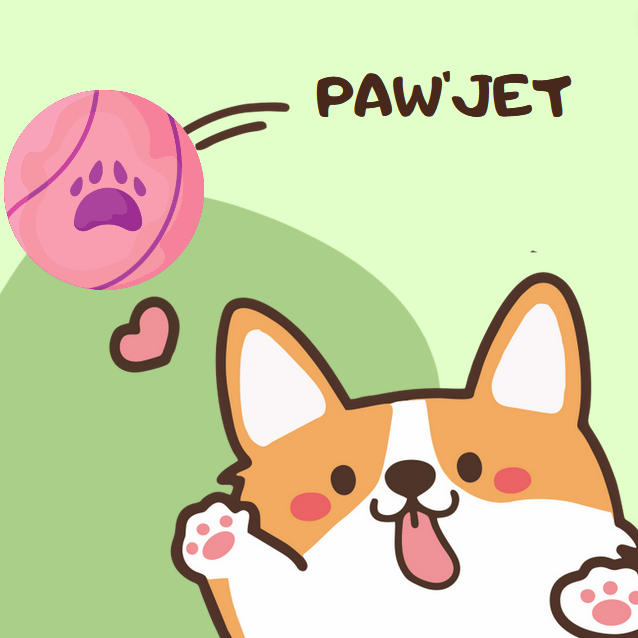
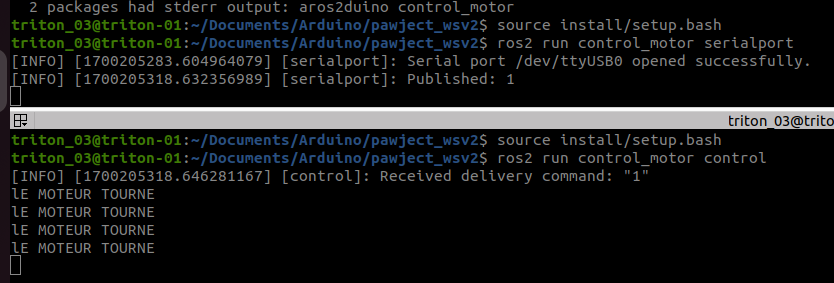
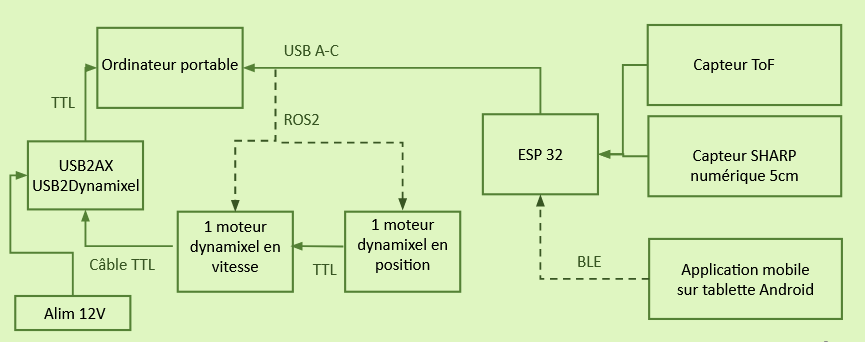

# pawject_elissalt
Projet Proto

Nous sommes Marie ARNAUD, Adrien COVAREL & Emma ELISSALT 

## Problématique
  
Comment optimiser les besoins d'exercice, de stimulation mentale et d'interaction autonome, afin d’éviter l’ennui de votre chien, tout en offrant une solution pratique pour vous, propriétaires ?  

## Notre projet
  
Nous avons mis en place un robot (fixe) capable de lancer la balle de votre chien. Il marche avec une application mobile connectée en Bluetooth au robot qui sert à lancer la balle lorsque l’utilisateur appuie sur le bouton.  

  
## Mise en route

Dans un premier temps il faut se connecter a notre application sur MIT App Inventor, PawJet (*PawJet.aia*). Pour cela, il suffit d'appuyer sur le bouton *connexion ble*. Puis dans la liste *devices* sélectionner le bluetooth *EMMA&MARIE* qui correspond a celui présent sur notre carte ESP32. Si nous sommes bien connectés alors la checkbox passe à *true*.   
Pour lancer la balle il faut ensuite appuyer sur le bouton *play with me*.   
Pour se déconnecter il faut appuyer sur *deconnexion ble*.  
  
Il faut ensuite ouvrir le logiciel *Arduino IDE 2* sur l'ordinateur portable et run le code *code_app_ble_test.ino*. Ce code permet de verifier qu'il y ai bien une balle dans le robot et s'il n'y a pas de chien (ou obstacle) dans le champ de tir lorsque l'utilisateur fait une demande de lancement de la balle.   
Si toutes ces conditions sont réunies alors le code print dans le *serial* un *1* pour indiquer que le lancer peut avoir lieu. Dans le cas contraire, on envoie rien. 
  
Maintenant il reste juste a activer les moteurs *Dynamixel* en se servant de *ROS2*. Pour cela nous avons crée un workspace *pawject_wsv2*. Dans le package *control_motor* se trouve le noeud *serialport.py* qui sert à publish sur le port série de la esp32 (endroit ou nous envoyons le 1 quand on peut tirer). Le noeud *control.py* sert a subscribe (recuperer l'information du publish) sur le noeud précédent pour commander les moteurs afin de pouvoir lancer la balle. Un moteur est en *control vitesse* pour mettre en tension le ressort en enroulant un fil. Le deuxième moteur est en *control position* pour déclencher le lancer. Ce dernier moteur fait glisser le support où est enroulé le fil afin de le dérouler d'un coup, permettant ainsi au ressort de se tendre et de propulser la balle. 
  
Voici comment communique nos noeuds :   

  

  
Dans un terminal, après avoir sourcé ros2 et s'etre mis dans le workspace, il suffit de lancer la commande *ros2 run control_motor serialport* et la commande *ros2 run control_motor control* dans un second terminal.  
Dans le premier terminal on peut voir ce qu'il y a comme information envoyée par l'ESP32 sur le serial.  
Dans le second terminal on peut voir les commandes exécutées en fonction des informations reçue par le topic *serial_data* (on souscrit a ce topic).

Voici le résultat dans les terminaux lorsque l'on lance les noeuds : 

  

## Architecture 

Voici l'architecture (hardware) de notre système : 
  

## Vidéo explicative 

Voici une vidéo de démonstration pour notre prototype : https://youtu.be/jBiW0mczfOc?feature=shared

## Poster / PowerPoint

Dans le dossier poster/powerpoint vous pouvez trouver un poster et une présentation powerpoint explicative de notre projet. 

## Conclusion 
Ce projet nous a permis de mettre en ouevre un prototype répondant à une problématique. Nous avons pu lors de la réalisation de ce prototype mettre en pratique énormément de compétences vu tout au long de nos études. Que ça soit du bas ou du haut niveau dans l'architecture, comme avec la maîtrise des servo moteurs Dynamixal sous ROS2, la communication en BLE entre une application mobile et une carte ESP32, ou alors plus simplement l'utilsation de capteurs de distance.   
C'etait vraiment interresant d'être libre dans le sujet et quasiment en autonomie pour sa réalisation. 

👍

